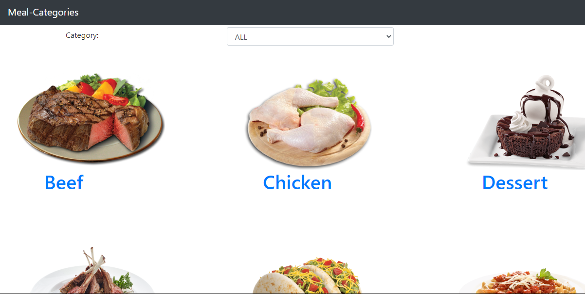

# Catalogue Stastics

This is a catalog statistics project built with react, HTML5, CSS3, and redux toolkit. It fetches data from https://www.themealdb.com/api/json/v1/1/categories.php API.

## Built With

- HTML5
- CSS3
- BOOTSTRAP4
- React
- REDUX TOOLKIT

## Live Demo
[Live_Demo](https://lidu-catalogue-stat.herokuapp.com/)

## Getting Started

To get a local copy up and make it run, follow these simple example steps.
-  git clone https://github.com/Lidya1234/catalogue_stat
- npm install
- npm start

## Test
- npm run test

### Prerequisites

- code editor
- Browser
- Node.js installed

### Setup

- install code editor
- Browser

## Author Details::

👤 **Lidya Ghebreigziabher**

- Github: [@Lidya-github ](https://github.com/Lidya1234)
- Twitter: [@Lidya-twitter](https://twitter.com/Lidya42676629)
- Linkedin: [Lidya-linkedin-link](https://www.linkedin.com/in/lidya-ghebreigziabher-4a94391aa/)
 

## 🤝 Contributing

Contributions, issues,and feature requests are welcome!

## Show your support

Give a ⭐️ if you like this project!
